# 01 — Entity Relationship Overview

Mermaid ER diagram (renders on GitHub / VSCode). All tables use `id UUID PK`, `created_at`, `updated_at`, `created_by`, `updated_by`, `deleted_at`, `version` unless noted.

```mermaid
erDiagram
  users ||--o{ user_roles : has
  roles ||--o{ user_roles : grants
  roles ||--o{ role_permissions : has
  permissions ||--o{ role_permissions : granted_via
  users ||--o{ audit_logs : actor
  users ||--o{ activity_logs : actor
  users ||--o{ sessions : owns

  categories ||--o{ products : classifies
  brands ||--o{ products : owns
  hsn_codes ||--o{ products : taxes
  units ||--o{ products : measured_in
  products ||--o{ product_variants : has
  product_variants ||--o{ product_images : has
  products ||--o{ certifications : listed_in
  product_variants ||--o{ product_price_history : selling_price
  product_variants ||--o{ purchase_price_history : buy_price

  warehouses ||--o{ stock_snapshots : holds
  warehouses ||--o{ stock_ledger : records
  product_variants ||--o{ stock_snapshots : per_wh
  product_variants ||--o{ batches : lot
  batches ||--o{ stock_ledger : moves

  vendors ||--o{ purchase_orders : issued_to
  purchase_orders ||--o{ po_items : has
  purchase_orders ||--o{ grn : receipts
  grn ||--o{ grn_items : has
  vendors ||--o{ vendor_invoices : bills

  distributors ||--|| users : is_a
  distributor_tiers ||--o{ distributors : classifies
  distributor_price_lists ||--o{ distributors : governs
  distributors ||--o{ orders : places
  customer_profiles ||--|| users : is_a
  customer_profiles ||--o{ addresses : owns
  customer_profiles ||--o{ orders : places
  customer_profiles ||--o{ wallets : has

  orders ||--o{ order_items : has
  orders ||--o{ order_status_history : timeline
  orders ||--o{ shipments : ships
  orders ||--o{ invoices : billed
  invoices ||--o{ invoice_items : has
  invoices ||--o{ credit_notes : may_have
  invoices ||--o{ debit_notes : may_have
  invoices ||--o{ payments : settles
  payments ||--o{ refunds : refunds

  coupons ||--o{ orders : applied
  tax_rules ||--o{ invoices : applied
  transporters ||--o{ shipments : carried_by
  courier_partners ||--o{ shipments : delivered_by
  payment_terms ||--o{ orders : governs

  tickets ||--o{ ticket_messages : threads
  returns }o--|| orders : against
```

## Legend
- Bold arrows = required (NOT NULL FK)
- Every FK ships with an index; composite indexes documented in `02-database-schema.md`.
